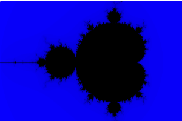

# gifect

Make GIFs with React.

## Example

Create a new React project with [CRA](https://facebook.github.io/create-react-app/)

```bash
yarn create react-app hello --typescript
```

Install gifect

```bash
yarn add gifect
```

Update `src/App.tsx`

```typescript
import React from 'react';
import { Root, withRenderer } from 'gifect';

const fps = 10;

const typer = (message: string, progress: number): string =>
  message.slice(0, message.length * progress);

const App: Root = state => {
  // state.progress is the percentage of completion it is between 0 and 1
  // you should return desired frame for that percentage of animation.

  return <div className="App">{typer('gifect', state.progress)}</div>;
};

export default withRenderer(App, {
  width: 45,
  height: 20,
  numFrames: 3 * fps, // 3 seconds
  fps,
});
```

Start React app with `yarn start`.

Create GIF with `gifect` in another tab.

```bash
yarn gifect http://localhost:3000 gifect.gif
```

Output GIF:


## Zoom into [Mandelbrot Set](https://en.wikipedia.org/wiki/Mandelbrot_set)

Update `src/App.tsx`

```typescript
import React from 'react';
import { Surface, Group, Shape } from 'react-art';
import Complex from 'complex.js';
import { Root, withRenderer } from 'gifect';

const BG_PATH =
  'M3.00191459,1 C1.34400294,1 0,2.34785514 0,4.00550479 L0,217.994495 C0,219.65439 1.34239483,221 3.00191459,221 L276.998085,221 C278.655997,221 280,219.652145 280,217.994495 L280,4.00550479 C280,2.34561033 278.657605,1 276.998085,1 L3.00191459,1 Z M3.00191459,1';

const fps = 10;
const width = 300;
const height = 200;
const maxIter = 80;

const mandelbrotIter = (c: Complex): number => {
  let z = Complex.ZERO;

  for (let i = 0; i <= maxIter; i++) {
    z = z.mul(z).add(c);

    if (z.abs() > 2) {
      return i;
    }
  }

  return maxIter;
};

const mapToRange = (
  x: number,
  oldMin: number,
  oldMax: number,
  newMin: number,
  newMax: number,
): number => ((x - oldMin) * (newMax - newMin)) / (oldMax - oldMin) + newMin;

const App: Root = state => {
  const zoom = mapToRange(state.progress, 0, 1, 1, 0.3);

  return (
    <Surface width={width} height={height}>
      <Group>
        {(() => {
          const groups: any[] = [];

          for (let w = 0; w <= width; w++) {
            for (let h = 0; h <= height; h++) {
              groups.push(
                <Group key={w + '_' + h} x={w} y={h}>
                  <Shape
                    fill={`hsla(242, 100%, ${mapToRange(
                      mandelbrotIter(
                        new Complex(
                          mapToRange(w, 0, width, -2 * zoom, 1 * zoom),
                          mapToRange(h, 0, height, -1 * zoom, 1 * zoom),
                        ),
                      ),
                      0,
                      maxIter,
                      50,
                      0,
                    )}%, 1)`}
                    d={BG_PATH}
                  />
                </Group>,
              );
            }
          }

          return groups;
        })()}
      </Group>
    </Surface>
  );
};

export default withRenderer(App, {
  width,
  height,
  numFrames: 3 * fps, // 3 seconds
  fps,
});
```

```bash
yarn gifect http://localhost:3000 mandelbrot.gif # this may take couple minutes
```

Output GIF:


